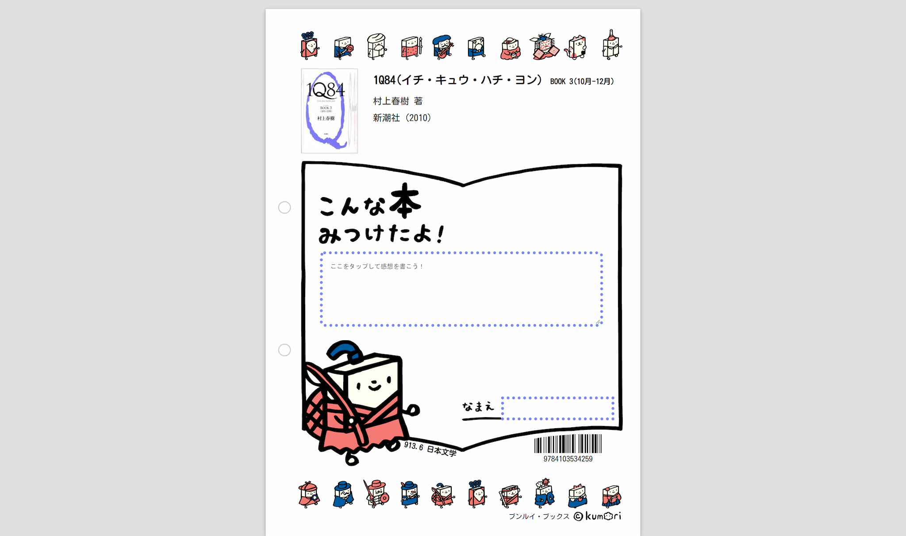

# Bunrui Paper

本の感想用ページの表示ツール

https://bunrui-paper.calil.dev/?id=4103534257&region=gk-2002000-3xj40&editable=true

## コンセプト

- 本の感想を書ける書式を、書誌データとともに表示する
- 感想・名前を書けるフォームを表示できる
- 既存の感想を表示できる
- URLからパラメータを受け取ることができる（連携API）



## 連携API

以下のようなURLでパラメータを受け取ることができます。

`https://bunrui-paper.calil.dev/?param1=xx&param2=xx`

|  パラメータ  |  内容  | 備考 |
| ---- | ---- | ---- |
|  id  |  書誌ID  | 必須 |
|  region  |  学校図書館支援プログラムのリージョンID  | 必須 |
|  editable  |  感想・名前のフォーム表示  | editable='true'で有効化 |

## 開発

ビルドツールは [Vite](https://vite.dev/) です。Node.js 20.19以降 または 22.12以降が必要です。

```
npm install  
npm start
```

http://localhost:3000 が開き、HTML・Sass・JSの変更が即座に反映されます(HMR)。

## リリースビルド

```
npm run build
```

`docs/` に出力されます。`npm run preview` でビルド結果をローカル確認できます。

`docs/` はビルド成果物なのでGitでは管理していません（CIがビルドして直接デプロイします）。

### ディレクトリ構成

| パス | 内容 |
| ---- | ---- |
| `index.html` | エントリ。Viteがここを起点に依存を解決する |
| `src/index.sass` | スタイルのエントリ。`sass/base` → `sass/components` の順に読み込む |
| `src/js/index.js` | アプリ本体。DOM操作とAPI呼び出し |
| `src/js/lib/` | 副作用のない関数群。ここだけ単体テストの対象 |
| `public/` | 変換せず `docs/` 直下にコピーされる（アセットと `CNAME`） |
| `vite.config.js` | 出力先・ファイル名・woff除去プラグイン・Vitestの設定 |
| `biome.json` | lint / format の設定 |

外部への実行時依存は npm パッケージにまとめています。CDNから直接読み込んでいるものはありません。

| 依存 | 用途 | 以前 |
| ---- | ---- | ---- |
| `jsbarcode` | ISBNバーコード | minify済みファイルをリポジトリに同梱 |
| `paper-css` | A4のレイアウト | cdnjs (0.3.0) |
| `@fontsource/kosugi-maru` | 本文フォント | Google Fonts |

`src/js/lib/ndc-divisions.js` はNDC綱目100件のラベル表です。飾りアイコンの `alt` を埋めるためだけに6MBのJSONを毎回取得していたので、固定表として同梱しています。細かい分類のラベルだけは ndc.dev のAPIから個別に取得します。

## テスト

```
npm test
```

`npm test` は以下を順に実行します。

| コマンド | 内容 |
| ---- | ---- |
| `npm run lint` | Biome による lint と整形チェック（`npm run format` で自動修正） |
| `npm run unit` | Vitest による `src/js/lib/` の単体テスト |
| `npm run build` | `docs/` へのビルド。構文エラーや依存の解決失敗はここで落ちる |
| `npm run verify` | 生成物の検証（`public/` のコピー・CSS/JSの生成・参照切れ・フォントとvendorのバンドル・外部CDNの混入） |

## CI

| ワークフロー | トリガー | 内容 |
| ---- | ---- | ---- |
| [Test](.github/workflows/test.yaml) | push(master) / pull_request | Node 22・24で `npm ci` + `npm test`、および `npm audit` |
| [Build and Deploy](.github/workflows/gh-pages.yaml) | push(master) | `npm test` が通ったら GitHub Pages へデプロイ |

依存パッケージとGitHub Actionsのバージョンは [Dependabot](.github/dependabot.yml) が毎週月曜に更新PRを作成します。

## デプロイ

GitHub Pages（ソースは「GitHub Actions」）で公開しています。`gh-pages` ブランチは使いません。カスタムドメインは `public/CNAME` で維持しています。

## アイコン

[ブンルイ・ブックス ©kumori](https://kumori.info/bunruibooks/)

Google Cloud Storageに保存\
https://console.cloud.google.com/storage/browser/kumori-ndc;tab=objects?forceOnBucketsSortingFiltering=false&project=calil-sandbox&prefix=&forceOnObjectsSortingFiltering=false

```
https://storage.googleapis.com/kumori-ndc/{{ndc}}_1.svg
https://storage.googleapis.com/kumori-ndc/{{ndc}}_2.svg
```

## ライセンス

The MIT License (MIT)

Permission is hereby granted, free of charge, to any person obtaining a copy
of this software and associated documentation files (the "Software"), to deal
in the Software without restriction, including without limitation the rights
to use, copy, modify, merge, publish, distribute, sublicense, and/or sell
copies of the Software, and to permit persons to whom the Software is
furnished to do so, subject to the following conditions:

The above copyright notice and this permission notice shall be included in all
copies or substantial portions of the Software.

THE SOFTWARE IS PROVIDED "AS IS", WITHOUT WARRANTY OF ANY KIND, EXPRESS OR
IMPLIED, INCLUDING BUT NOT LIMITED TO THE WARRANTIES OF MERCHANTABILITY,
FITNESS FOR A PARTICULAR PURPOSE AND NONINFRINGEMENT. IN NO EVENT SHALL THE
AUTHORS OR COPYRIGHT HOLDERS BE LIABLE FOR ANY CLAIM, DAMAGES OR OTHER
LIABILITY, WHETHER IN AN ACTION OF CONTRACT, TORT OR OTHERWISE, ARISING FROM,
OUT OF OR IN CONNECTION WITH THE SOFTWARE OR THE USE OR OTHER DEALINGS IN THE
SOFTWARE.
